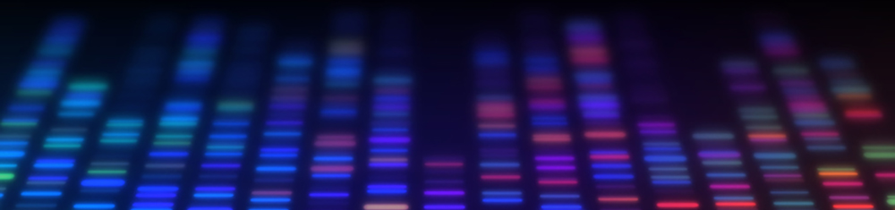

The Systems Genomics Lab at [The American University in Cairo](https://www.aucegypt.edu/) ([AUC](https://www.aucegypt.edu/)) is interested in deciphering the complex interactions between human genetics and the human microbiome in health and disease. The group employs genome analytics and machine learning to analyze and integrate multidimensional phenotypic and multi-omics data to understand better the roles of nature and nurture in shaping our lives.

## Projects&nbsp;&nbsp;&nbsp;&nbsp;&nbsp;|&nbsp;&nbsp;&nbsp;&nbsp;&nbsp;[Members](/members)
