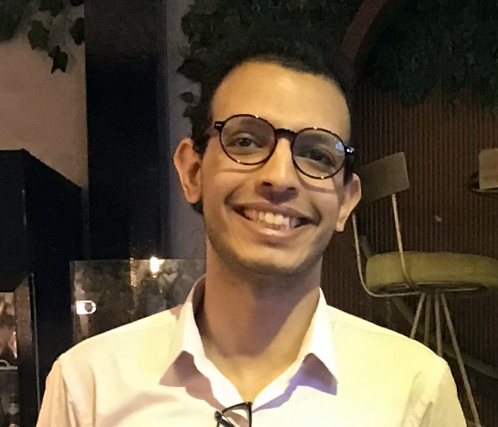

# Ahmed M. Kazlak

Ahmed M. Kazlak is a graduate student in the biotechnology program at [the American University in Cairo](https://www.aucegypt.edu/) ([AUC](https://www.aucegypt.edu/)). Ahmed obtained his undergraduate degree in Pharmaceutical Sciences from [Mansoura Univeristy](https://www.mans.edu.eg/en).

 



