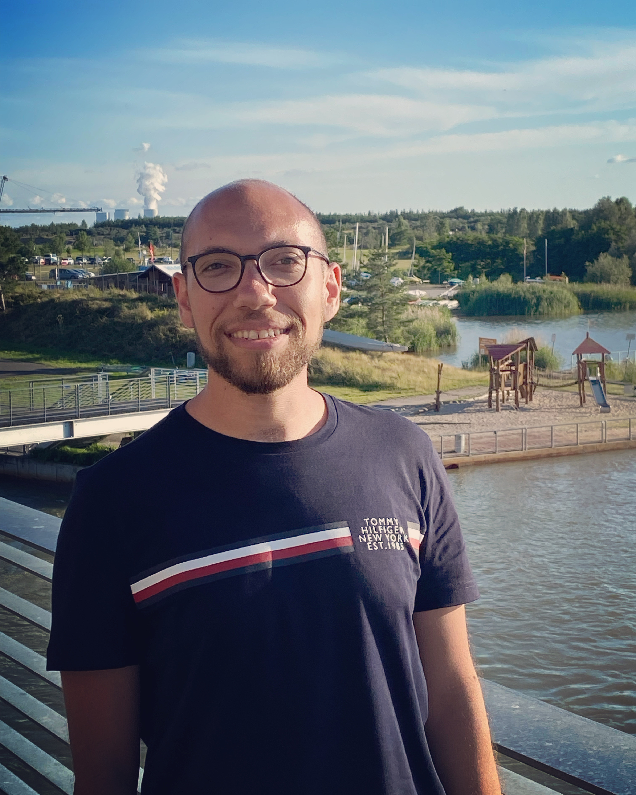

# Moustafa Abohawya

Moustafa Abohawya was a member of the lab from 2014 to 2016. He graduated from the [Faculty of Pharmacy](https://pha.tanta.edu.eg/en/), Tanta University, Egypt in 2012. In 2013, Moustafa joined the [American University in Cairo](https://www.aucegypt.edu/) to pursue his master's degree in Biotechnology as a research/teaching fellow. In 2014, he was awarded the [Al-Alfi Foundation](https://www.alalfifoundation.org/) scholarship to support his graduate studies. In his master thesis, Moustafa worked on understanding the alterations of splicing in *Arabidopsis thaliana* in response to splicing modulating drugs in collaboration with [King Abdullah University for Science and Technology](https://www.kaust.edu.sa/en). After graduation, Moustafa joined [Zewail City for Science and Technology](https://www.zewailcity.edu.eg/) as a Biomedical Science teaching assistant. In 2019, Moustafa moved to Dresden, Germany to join the [University Cancer Center](https://tu-dresden.de/med/uniklinikum) and [Mildred Sheel Early Career Center](https://tu-dresden.de/med/mf/msnz/kollegiaten/tandem-jovan-mircetic-sebastian-garcia), Faculty of Medicine Carl Gustave Carus, TU Dresden. He is working in the lab of Prof. Frank Buchholz as a Ph.D. student. In his Ph.D. project, Moustafa is utilizing a functional genomics approach to understand chemotherapy resistance in gastric cancer. He is combining omics, CRISPR-based screens as well as patient-derived organoids systems to identify genetic markers and mechanisms of gastric cancer resistance to chemotherapeutic agents frequently used in the course of treatment of gastric cancer. 



