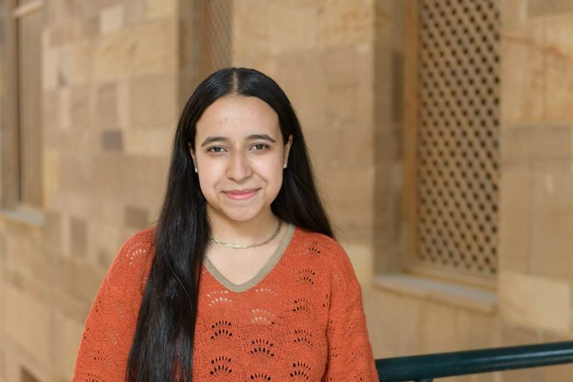

# Rana Salah

Rana Salah is a fresh graduate who obtained her undergraduate studies in Cell & Molecular Biology from the [American University in Cairo](https://www.aucegypt.edu/) (AUC) with a double minor in Bioinformatics and Chemistry.

Her research interests involve the applications of multi-omic approaches in biological and environmental studies. In 2020, Rana co-founded and led the first team from AUC to participate in the [International Genetically Engineered Machine](https://igem.org/) ([iGEM](https://igem.org/)) competition focused on Synthetic Biology. Forming a multidisciplinary team of AUC undergraduates to develop a therapeutic syn-bio-based treatment for SARS-CoV-2, for which they got awarded a Silver medal, helped Rana discover her passion for virology, genetics, drug delivery systems, and science communication! Afterward, as a laboratory assistant, she worked on developing diagnostic kits for COVID-19 on the genetic level.

In 2021, she was selected to be the transcriptomics team leader in the HackBio internship supervising 20 researchers working on identifying biomarkers for bladder cancer heterogeneity. In 2019, she was an undergraduate research assistant at AUC, working on detecting early biomarkers of ovarian cancer as well. Rana believes in the power of bioinformatics in advancing precision medicine research. Accordingly, she is concerned about African and Middle Eastern representation in the available datasets. Hence, She joined the SynBio Africa Association after her participation as a guest speaker and panelist in the first Inaugural Synthetic Biology and Biosecurity conference held in Uganda in 2021.

Furthermore, she is an advocate for interdisciplinary hands-on education. Currently, as the first Egyptian Coordinator for the [Next Generation Global Health Security Network](https://www.facebook.com/nextgenghsa/), she is working on increasing the accessibility of Egyptian students, researchers, and early-career professionals in Health Security and Synthetic Biology.

However, Rana is not only involved with medical research, defining herself as a global citizen. She worked on biodegradable plastics and biomass-related research through her participation as an [AIESEC](https://aiesec.org/) volunteer in Ukraine, 2019, and as an Egyptian delegate in the 12th Asian Science Camp in Indonesia, 2018. Finishing her undergraduate studies, Rana targets building on her capstone work in using Artificial Intelligence for enhanced personalized medicine applications reducing the misdiagnosis and late diagnosis of cardiovascular diseases.

Furthermore, she aims to reduce the gap between the research and industry through bio-entrepreneurship, offering affordable and efficient tools as the genotoxicity assessment method she proposed in her graduation thesis.

As a next step, Rana wants to explore the possible role of the microbiota-gut-brain axis in neurodevelopmental diseases such as [Autism Spectrum Disorder](https://www.cdc.gov/ncbddd/autism/facts.html) ([ASD](https://www.cdc.gov/ncbddd/autism/facts.html)) using Systems Biology.

[<i class="fab fa-github fa-2x"></i>](https://github.com/rana-salah)
[<i class="fab fa-linkedin fa-2x"></i>](https://www.linkedin.com/in/rana-salah-biology/)
[<i class="fab fa-facebook fa-2x"></i>](https://www.facebook.com/salah.foaud)



