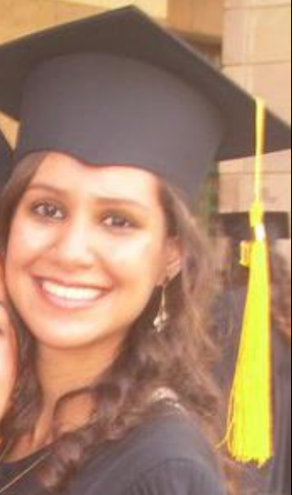

# Sarah Halawa

Sarah Halawa is a Post Doc (Bioinformatics and Data Science)/Research Scientist at [Magdi Yacoub Aswan Heart Centre](https://myf-egypt.org/aswan-heart-centre/) ([Magdi Yacoub Heart Foundation](https://www.myf-egypt.org/)) (AHC). She completed her Ph.D. in Applied Sciences and Engineering with a specialization in Biotechnology focused on data science and bioinformatics in December 2020 as a joint collaboration between the American University in Cairo (AUC) and AHC. Her Ph.D. focused on profiling genome-wide DNA methylation patterns in human aortic and mitral valves, for which she has been awarded the [L’Oréal-UNESCO For Women in Science Fellowship](https://en.unesco.org/science-sustainable-future/women-in-science/laureates) in 2019. She obtained her MSc in Physics in 2014 at AUC and her BSc in Electronics Engineering from AUC with a minor in Mathematics in 2011 at AUC. Her multidisciplinary background enables her to work with highly qualified teams on challenging interdisciplinary projects that primarily focus on cardiovascular diseases (CVDs) specific to the Egyptian population. In addition to expanding on her Ph.D. work, she currently works on many projects focusing on translational bioinformatics and the integration of bioinformatic techniques into genetic and clinical research to improve health outcomes for patients.



