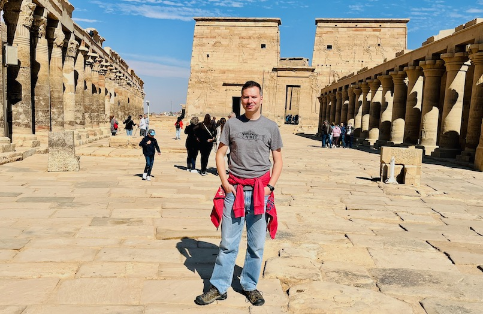

# Ahmed Moustafa

[Ahmed Moustafa](https://ahmedmoustafa.com) is a professor of bioinformatics and systems biology at [the American University in Cairo](https://www.aucegypt.edu/) ([AUC](https://www.aucegypt.edu/)). Ahmed is also an adjunct scientist with [J. Craig Venter Institute](https://www.jcvi.org/) ([JCVI](https://www.jcvi.org/)) and a member of the scientific committee of the Egyptian Genome Project (EGP). Ahmed obtained his undergraduate degree in Computer Science from [Alexandria University](https://www.alexu.edu.eg/index.php/en/) and his Ph.D. in Genetics from [the University of Iowa](https://uiowa.edu/).

---
[Home](/) | [Projects](/projects) | [Members](/members)



